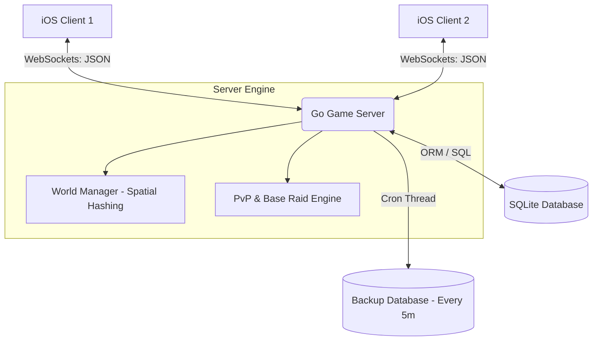

# 📍 GeoLive — Real-Time Multiplayer PvP Map Game

[](https://developer.apple.com/ios/)
[](https://swift.org/)
[](https://go.dev/)
[](https://developer.mozilla.org/en-US/docs/Web/API/WebSockets_API)
[](https://sqlite.org/)

**GeoLive** is an innovative, real-time multiplayer PvP game built on top of real-world maps (MapKit). Players can move around the real world, build and upgrade bases, raid opponents' buildings, collect valuable fallen enemy remains (Skulls), and engage in real-time battles synced via WebSockets.

The project is split into two core components:
1. **iOS Client (Swift / UIKit / MapKit)** — An interactive map client with a premium custom user interface.
2. **Go Backend (WebSockets / Spatial Hashing)** — A high-performance game server managing the active world state, PvP interactions, and permanent data persistence using SQLite.

---

## 🛠 System Architecture

Below is a diagram showing the real-time interaction between components:



---

## ✨ Core Features

| Module | Description | Tech / Architecture |
| :--- | :--- | :--- |
| **📍 Map PvP & Movement** | Real-time player rendering and smooth movement synchronization across MapKit. | `MapKit`, `CoreLocation`, `WebSockets` |
| **⚔️ PvP & Base Raids** | Raid other players' bases when moving within their proximity radius. Rewards: +250 Coins and +100 XP. | `Geofencing`, `Spatial Proximity Check` |
| **☠️ Skull Remains Sync** | Slain enemies drop skull remains on the map. Collecting them in proximity updates instantly for all nearby players. | `WebSockets Broadcast`, `Global Cooldowns` |
| **📈 Global Auto-Collect** | Long-press anywhere on the screen to trigger automated coin and resource collection from all owned buildings. | `Swift UI-Gestures`, `Server validation` |
| **🗄 SQLite DB & Backup** | Permanent persistence of player profiles, levels, coins, gems, and building states with background backups every 5 minutes. | `go-sqlite3`, `Goroutines / Tickers` |
| **🚀 Spatial Hashing** | Grid-based coordination mapping to search nearby players fast and minimize network overhead. | `Thread-safe Grid Hashing (Server)` |

---

## 📂 Repository Directory Structure

```text
├── GeoLive.xcodeproj        # Xcode project file
├── GeoLive.xcworkspace      # Xcode Workspace (use this to launch with CocoaPods)
├── Podfile                  # CocoaPods dependency configuration
├── Modules/                 # Modular iOS Client architecture
│   ├── Auth/                # Registration, sign-in flow, and coordination
│   ├── Buildings/           # Building models, structures, and upgrades
│   └── Main/                # Core gameplay module
│       ├── Controllers/     # MainMapViewController (core MapView integration)
│       ├── Services/        # GameWebSocketService (network socket lifecycle)
│       ├── Views/           # Custom annotations, controls, and alert views
│       └── Models/          # Core game model structures
├── UIComponents/            # Reusable UI alerts, modals, and notifications
├── Server/                  # High-performance Go Backend
│   ├── db.go                # SQLite initialization, schema migrations, and backups
│   ├── world.go             # WorldManager, Grid-based Spatial Hashing
│   ├── hub.go               # Hub for client routing and multiplexing WebSockets
│   ├── client.go            # WebSocket read/write loops and handler logic
│   ├── main.go              # Entry point, HTTP routes, and WebSocket upgraded listener (port 8082)
│   └── models.go            # Shared data transfer objects (JSON payload schemas)
└── README.md                # Project documentation
```

---

## 🚀 Quick Start Guide

Since local machine user states and absolute paths are completely cleaned and managed by `.gitignore`, setting up the project takes less than two minutes.

### Step 1: Spin up the Go Backend (Go + SQLite)

Navigate to the Server folder, download dependencies, and run the backend.

```bash
# Navigate to the server folder
cd Server

# Tidy and fetch Go dependencies
go mod tidy

# Start the Go server (the database geolive.db is created automatically)
go run .
```

*The server will start running on port `8082` (preventing address conflicts with native macOS services).*

### Step 2: Initialize the iOS Client (Xcode + CocoaPods)

Ensure you have [CocoaPods](https://cocoapods.org/) installed on your macOS machine.

```bash
# Install iOS dependencies from the root directory
pod install
```

> [!IMPORTANT]  
> Always open the **`GeoLive.xcworkspace`** workspace file in Xcode, rather than the raw `.xcodeproj` file.

---

## 📡 WebSocket API Protocol (Sample Payloads)

All events between the iOS Client and Go Server are transferred as lightweight JSON structures.

### 1. Location Update (Client ➔ Server)
Sent by the client whenever the player moves or core location updates:
```json
{
  "type": "location",
  "player_id": "player_100",
  "latitude": 55.7558,
  "longitude": 37.6173
}
```

### 2. Base Raid Event (Client ➔ Server ➔ Broadcast)
Fired when a player triggers an attack on an enemy base inside their range:
```json
{
  "type": "base_raid",
  "player_id": "player_100",
  "target_player_id": "player_200",
  "building_id": "bld_999",
  "damage": 50
}
```

### 3. Skull Remains Spawn (Server ➔ Client Broadcast)
Broadcast by the server to all players within view range when a collectible skull spawns on the map:
```json
{
  "type": "skull_spawn",
  "skull_id": "skull_abc123",
  "latitude": 55.7562,
  "longitude": 37.6180,
  "experience_reward": 100,
  "gold_reward": 250
}
```

---

