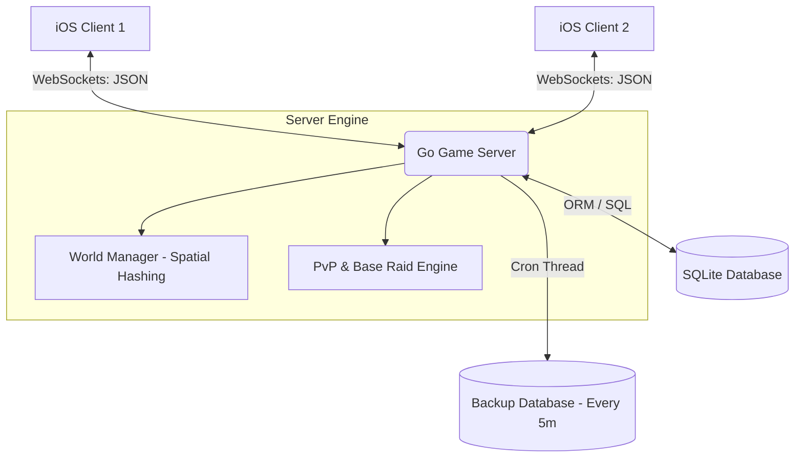

# 📍 GeoLive — Real-Time Multiplayer PvP Map Game

[](https://developer.apple.com/ios/)
[](https://swift.org/)
[](https://go.dev/)
[](https://developer.mozilla.org/en-US/docs/Web/API/WebSockets_API)
[](https://sqlite.org/)

**GeoLive** — это инновационная многопользовательская игра в реальном времени с элементами PvP, построенная на базе реальных географических карт (MapKit). Игроки могут перемещаться по реальному миру, строить и улучшать базы, совершать рейды на постройки соперников, собирать ценные останки врагов (Skulls) и сражаться друг с другом в реальном времени с использованием WebSocket-синхронизации.

Проект состоит из двух ключевых компонентов:
1. **iOS Client (Swift / UIKit / MapKit)** — интерактивный картографический клиент с кастомным интерфейсом.
2. **Go Backend (WebSockets / Spatial Hashing)** — высокопроизводительный игровой сервер, управляющий миром, PvP-боями и постоянным хранением данных в SQLite.

---

## 🛠 Архитектурная схема системы

Ниже представлена диаграмма взаимодействия систем в реальном времени:



---

## ✨ Ключевые возможности проекта

| Модуль | Описание функционала | Технологии / Архитектура |
| :--- | :--- | :--- |
| **📍 Map PvP & Movement** | Отображение игроков на карте MapKit в реальном времени с плавным перемещением. | `MapKit`, `CoreLocation`, `WebSockets` |
| **⚔️ PvP & Base Raids** | Рейды на базы других игроков при входе в радиус действия. Награда: +250 Coins и +100 XP. | `Geofencing`, `Spatial Proximity Check` |
| **☠️ Skull Remains Sync** | Выпадение останков (черепов) поверженных врагов на карту, сбор черепов в радиусе с мгновенным обновлением у всех игроков. | `WebSockets Broadcast`, `Global Cooldowns` |
| **📈 Global Auto-Collect** | Сбор монет и ресурсов со всех принадлежащих игроку зданий по долгому нажатию на экран. | `Swift UI-Gestures`, `Server validation` |
| **🗄 SQLite DB & Backup** | Сохранение прогресса игрока (монеты, кристаллы, уровень, здания) с регулярным резервным копированием каждые 5 минут в фоновом режиме. | `go-sqlite3`, `Goroutines / Tickers` |
| **🚀 Spatial Hashing** | Использование сетки координат для быстрого поиска ближайших игроков и оптимизации трафика сети. | `Thread-safe Grid Hashing (Server)` |

---

## 📂 Структура репозитория

```text
├── GeoLive.xcodeproj        # Xcode проект приложения
├── GeoLive.xcworkspace      # Xcode Workspace (используется для запуска с CocoaPods)
├── Podfile                  # Файл конфигурации внешних iOS-зависимостей
├── Modules/                 # Модульная структура iOS-клиента
│   ├── Auth/                # Регистрация, авторизация и координация
│   ├── Buildings/           # Модели и логика игровых построек
│   └── Main/                # Основной игровой процесс
│       ├── Controllers/     # Основной MainMapViewController (интеграция карты)
│       ├── Services/        # GameWebSocketService (менеджер соединений)
│       ├── Views/           # Кастомные аннотации, кнопки, алерты
│       └── Models/          # Игровые структуры данных
├── UIComponents/            # Повторно используемые компоненты интерфейса (алерты, плашки)
├── Server/                  # Высокопроизводительный сервер на Go
│   ├── db.go                # Инициализация SQLite, миграции схемы БД, бэкапы
│   ├── world.go             # WorldManager, Grid-based Spatial Hashing
│   ├── hub.go               # Хаб для координации WebSocket-клиентов
│   ├── client.go            # Клиентские циклы чтения/записи сокетов
│   ├── main.go              # Точка входа в сервер, HTTP/WS роутинг (порт 8082)
│   └── models.go            # Общие DTO структуры для JSON-пакетов
└── README.md                # Документация проекта
```

---

## 🚀 Быстрый старт для разработчиков

Так как локальные конфигурации участников команды полностью вынесены в `.gitignore`, проект разворачивается за пару минут.

### Шаг 1: Настройка и запуск Backend (Go + SQLite)

Перейдите в папку сервера, соберите зависимости и запустите приложение.

```bash
# Переход в директорию сервера
cd Server

# Скачивание и оптимизация зависимостей
go mod tidy

# Запуск Go сервера (база данных geolive.db создастся автоматически)
go run .
```

*Сервер запустится на порту `8082` (для предотвращения конфликтов со стандартными портами macOS).*

### Шаг 2: Настройка iOS клиента (Xcode + CocoaPods)

Убедитесь, что у вас установлен [CocoaPods](https://cocoapods.org/).

```bash
# Установка iOS-зависимостей из корневой директории
pod install
```

> [!IMPORTANT]  
> Всегда открывайте файл рабочей области **`GeoLive.xcworkspace`** в Xcode, а не индивидуальный проект `.xcodeproj`.

---

## 📡 Протокол WebSocket взаимодействия (Примеры сообщений)

Обмен игровыми событиями между iOS-клиентом и Go-сервером происходит посредством JSON-сообщений следующего формата.

### 1. Обновление локации игрока (Отправка на сервер)
Отправляется клиентом при изменении геопозиции на карте:
```json
{
  "type": "location",
  "player_id": "player_100",
  "latitude": 55.7558,
  "longitude": 37.6173
}
```

### 2. Рейд на чужую базу (Синхронизация PvP)
Инициируется клиентом, когда игрок атакует здание врага:
```json
{
  "type": "base_raid",
  "player_id": "player_100",
  "target_player_id": "player_200",
  "building_id": "bld_999",
  "damage": 50
}
```

### 3. Выпадение останков (Событие от Сервера)
Рассылается сервером всем игрокам в радиусе видимости при появлении нового Skull Remains на карте:
```json
{
  "type": "skull_spawn",
  "skull_id": "skull_abc123",
  "latitude": 55.7562,
  "longitude": 37.6180,
  "experience_reward": 100,
  "gold_reward": 250
}
```

---

## 🤝 Совместная разработка и Git-правила

Для предотвращения конфликтов версий и ошибок путей при работе в команде, строго соблюдайте следующие правила:
1. **Никогда не коммитьте скрытые папки Xcode**: Папка `.xcworkspace/xcuserdata/` содержит пути к вашему локальному диску на Mac и находится в глобальном игнорировании.
2. **Папка `Pods/` закрыта для коммитов**: Все внешние библиотеки подтягиваются индивидуально каждым разработчиком через `pod install`.
3. **Локальная база данных SQLite**: Файлы `Server/geolive.db` и файлы транзакций `geolive.db-journal` также полностью игнорируются, чтобы разработчики не перезаписывали прогресс друг друга.
